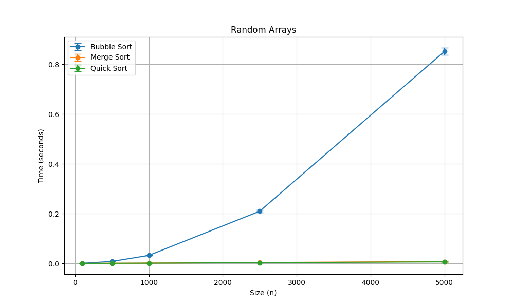
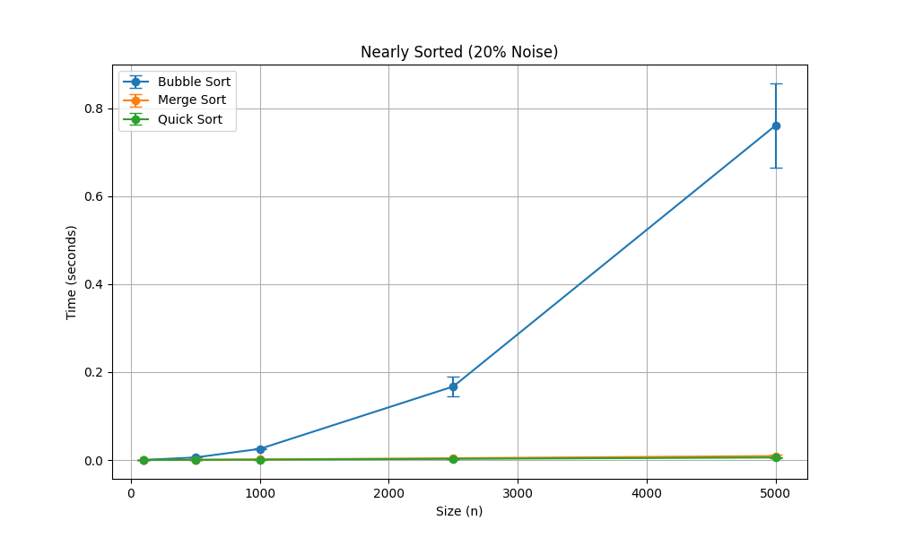

Data Structures and Algorithms (371-1-0341)
Sorting Algorithm Comparison 🛋️

Tal Brodstein
Adva Nesher

Selected Algorithms
For this assignment, I implemented and compared:
1. **Bubble Sort** (Algorithm ID: 1)
2. **Merge Sort** (Algorithm ID: 4)
3. **Quick Sort** (Algorithm ID: 5)

---

## Part B: Random Arrays (result1.png)
In this experiment, I compared the algorithms using arrays of random integers.

**Explanation:** As the array size ($n$) increases, we can clearly see the **Bubble Sort** curve growing quadratically ($O(n^2)$). In contrast, **Merge Sort** and **Quick Sort** follow a much flatter $\Theta(n \log n)$ trajectory. Because the $O(n^2)$ time grows so much faster, the $n \log n$ algorithms look almost like a straight line at the bottom of the graph.

---

## Part C: Nearly Sorted Arrays - 20% Noise (result2.png)
In this experiment, I started with a perfectly sorted array and then applied **20% noise** (random swaps).

**Explanation:** In this nearly-sorted scenario, the running times changed significantly. **Bubble Sort** performed much faster here than in the random experiment. This is because the "swapped" flag in my implementation allows the algorithm to terminate early when it detects segments are already in order. However, **Merge Sort** remained consistent with its $\Theta(n \log n)$ performance, as it always performs the same number of divisions and merges regardless of the input's initial order.

---

## How to Run
To run the default experiments:
`python run_experiments.py`

To run a custom experiment (Part D):
`python run_experiments.py -a 1 4 5 -s 100 500 1000 -e 2 -r 10`